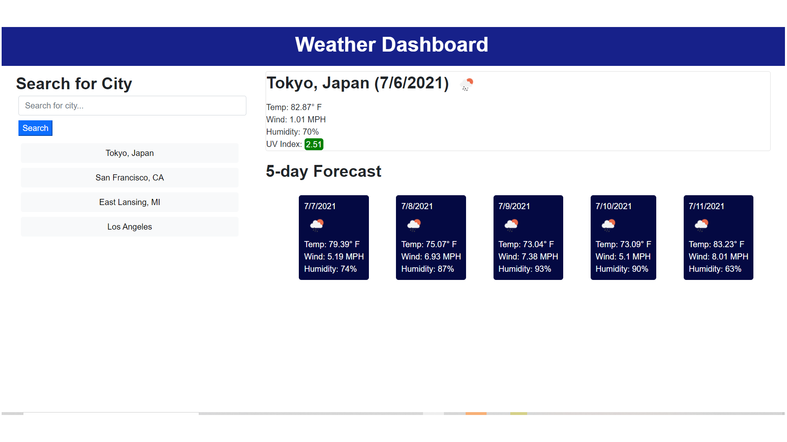

# Weather Dashboard

A dashboard for viewing the weather conditions in multiple cities. I had some challenges
with dabbling with both APIs (MapBox and OpenWeather), but once I figured it out, the process was much simpler for me to overcome.

https://mels065.github.io/weather-dashboard/